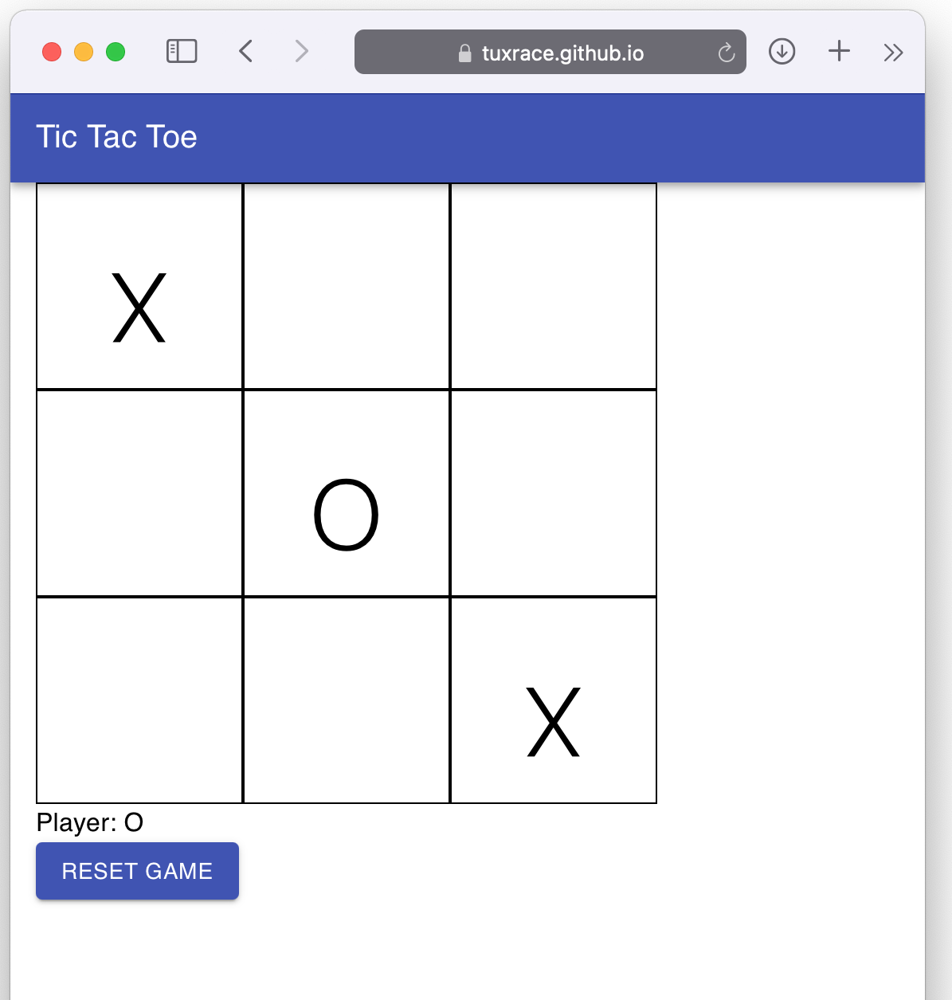

# React tic tac toe
> This project was developed using react and typescript

### Working link
https://tuxrace.github.io/react-tic-tac/

### Screen

### To run
- Type `yarn` inside the project directory
- After installation completed type `yarn run start`
- A browser should open pointing to  `http://localhost:3000`

### To deploy to github pages

- Type `yarn run deploy`
- This will trigger a build and copy athe budle file to gh-pages branch.
